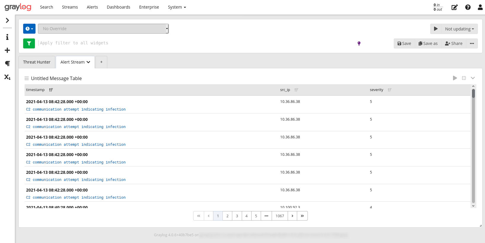

# Network Behavior Analytics for Graylog

This content pack establishes a GELF input by which AlphaSOC alerts can be sent to Graylog by [Network Flight Recorder (NFR)](https://github.com/alphasoc/nfr), and a dashboard to summarize infected hosts and anomalies within the environment. NFR performs scoring of network traffic (DNS and IP events) which can be collected on the wire, or loaded via Bro IDS, Suricata, or other sources.

## Screenshot




## Provided Content

* A TCP GELF input receive alerts from NFR (default port: 12201)
* A stream that matches NFR events
* A dashboard which summarizes the alerts and suspicious domains

## Sending NFR Events to Graylog

To escalate AlphaSOC alerts from NFR via GELF you must define the Graylog server address within `config.yml` (under the `outputs:` section) as below. NFR scores network traffic via the AlphaSOC Analytics Engine and escalates alerts to Graylog.

```
# Graylog server URI where AlphaSOC alerts will be sent in GELF format
# The Network Behavior Analytics for Graylog content pack establishes
# an input on TCP port 12201, which can be used to plug-and-play here.
graylog:
  # URI to the server (for example tcp://127.0.0.1:12201)
  # Default: (none)
  uri:
  # Message level.
  # Default: 1
  level: 1
```

## AlphaSOC Alert Format

The alert format and fields within Graylog are described in the table below.

| Field            | Description                                                              |
|------------------|--------------------------------------------------------------------------|
| `host`           | NFR engine generating the alert                                          |
| `engine_agent`   | NFR engine version (e.g. `Alphasoc NFR/1.9.0`)                           |
| `original_event` | Timestamp of the original network event (e.g. DNS request)               |
| `src_ip`         | IP address of the client / endpoint generating the traffic               |
| `dest_ip`        | IP address of a suspicious destination                                   |
| `threat`         | Short threat label (e.g. c2_communication)                               |
| `message`        | Long threat label (e.g. "C2 communication attempt indicating infection") |
| `severity`       | Event severity (5: critical, 4: high, 3: medium, 2: low, 1: info)        |
| `flags` | A list of [low-level flags](https://docs.alphasoc.com/ae/flags/) used within AE to generate alerts and categorize traffic |
| `query`          | DNS request FQDN associated with the alert (e.g. badguy123.ru)           |
| `record_type`    | DNS request record type associated with the alert (e.g. A, MX, SRV)      |

## Contributors

- Chris D'Amore